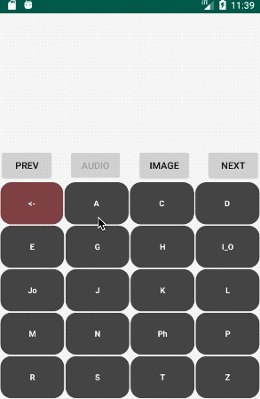

# AndroidBibleUtils
General tools for integrating and navigating the Bible on Android, leveraging [YouVersion's](https://www.youversion.com/) APIs:
* Passage selector `BibleNavSmall` auto-sizing custom View
* Passage text fetcher `YVFetcher` or fetch from local files (not included) via `LocalBibleFetcher`
* Audio fetcher and player `PassagePlayer`
* Get Lens-like verse text art via `VerseBitmapFetcher` (thanks, Scott!)

Demo app showing `BibleNavSmall` UI, `YVFetcher` grabbing verses, and `VerseBitmapFetcher` for image:
<center></center>

## Implementation
### Include as a Jitpack library

Use the latest tagged version shown here:
[https://jitpack.io/#briandherbert/AndroidBibleUtils](https://jitpack.io/#briandherbert/AndroidBibleUtils)

In your projects's build.gradle file, add the jitpack repo:
```
allprojects {
    repositories {
        google()
        jcenter()
        maven { url 'https://jitpack.io' }
    }
}
```
Then in the app module's build.gradle, add the dependency (use latest version):

`implementation 'com.github.briandherbert:AndroidBibleUtils:v3.0.3'`

### Specific requirements
For fetching verses, include internet permissions in **AndroidManifest**:<br>
```<uses-permission android:name="android.permission.INTERNET" />```

**PassagePlayer** (audio) requires the obscure AndroidManifest line `           android:usesCleartextTraffic="true"` under the `<application` tag


See the [demo app](https://github.com/briandherbert/AndroidBibleUtils/blob/master/app/src/main/java/com/example/brianherbert/androidbibleutils/DemoBibleUtilsActivity.kt) for examples.
